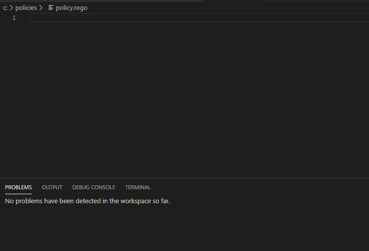

# vscode-regolint [](https://github.com/plexsystems/vscode-regolint/blob/master/LICENSE) [](https://github.com/plexsystems/vscode-regolint/releases)

vscode-regolint enables you to lint [Rego](https://www.openpolicyagent.org/docs/latest/policy-language/) files directly within [Visual Studio Code](https://code.visualstudio.com/)


## Example



## Installation

This extension can be installed through the Visual Studio [marketplace](https://marketplace.visualstudio.com/items?itemName=Plex.vscode-regolint). Alternatively, a VSIX installer is available on the [releases](https://github.com/plexsystems/vscode-regolint/releases) page.

```
NOTE: OPA must be installed and available in your PATH
```

## Local Development
To install the needed dependencies run `npm install`

To compile the solution locally run `npm run compile`

To run the extension in a Visual Studio Code development environment press `F5` in Visual Studio Code